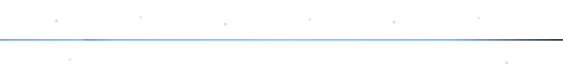

---

## 📊 GitHub Analytics

#### Contribution snake *(last 365 days)*

<picture>
  <source media="(prefers-color-scheme: dark)" srcset="assets/github-snake-dark.svg" />
  <source media="(prefers-color-scheme: light)" srcset="assets/github-snake.svg" />
  
</picture>

---

## 📦 Featured Projects

| Project | Description |
|---------|-------------|
| [**Nexora Service Suite**](https://github.com/arash-ahmadii/Nexora-Service-Suite) | Enterprise modular service management (RBAC, automation, chat, PDF invoicing). |
| [**Back-To-Work**](https://github.com/arash-ahmadii/Back-To-Work) | Behavior-driven productivity extension for structured focus cycles. |
| [**MentorQ Bot**](https://github.com/arash-ahmadii/mentorq-bot) | Webhook-based Telegram Q&A automation. |
| [**TextMorpher**](https://github.com/arash-ahmadii/textmorpher) | WordPress plugin for site-wide text overrides and safe DB find & replace. |

---

## ▣ Engineering Philosophy

I design **structured, automation-driven systems** built for long-term scalability and operational clarity.

- Modular design · Workflow optimization · RBAC · Performance monitoring · Measurable improvements

---

## 🛠 Engineering Signals

- End-to-end system ownership  
- Structured workflow decomposition  
- Automation-first mindset  
- Production-ready architecture  
- Clean, maintainable code  

---

## 📬 Connect

| | |
|--|--|
| **Agency** | [dashweb.agency](https://dashweb.agency) |
| **LinkedIn** | [linkedin.com/in/arash-ahmadii-640a83104](https://linkedin.com/in/arash-ahmadii-640a83104) |
| **Email** | dev@dashweb.agency |

*Remote · Europe*

